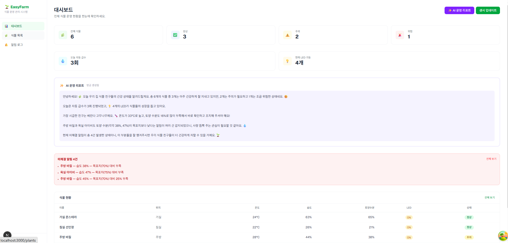
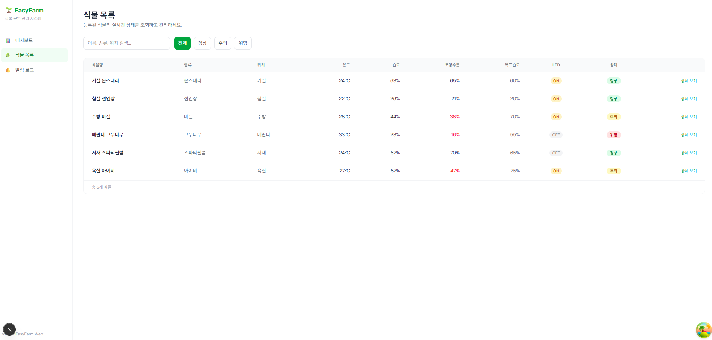
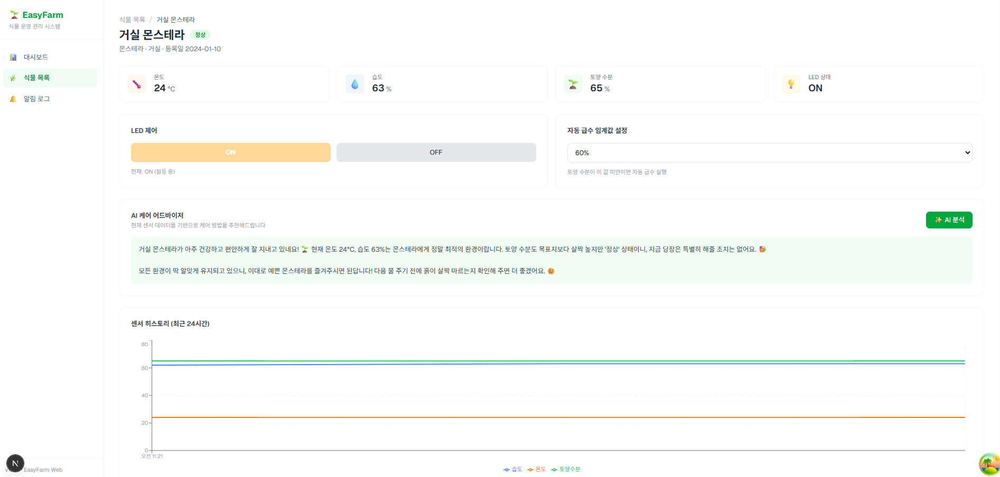
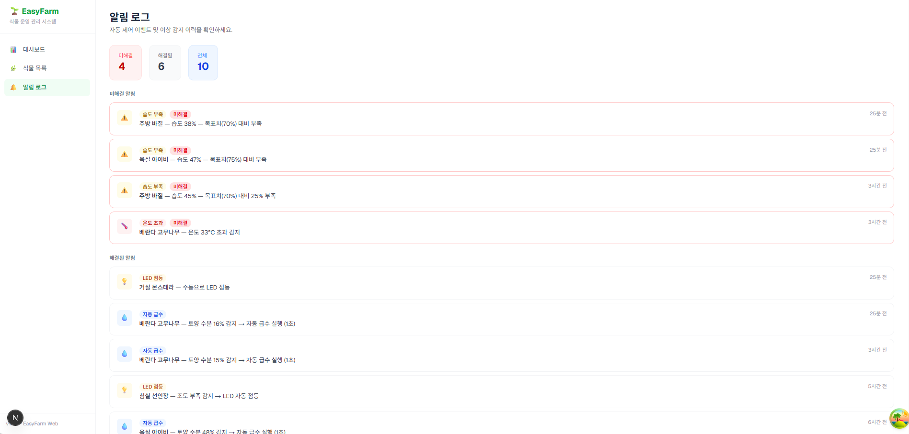

# EasyFarm (이지팜)


> IoT 기반 스마트 식물 관리 시스템 → AI 연동 웹 운영 관리 시스템으로 리팩토링

---

## 프로젝트 소개

EasyFarm은 **Arduino + Android 블루투스 IoT 시스템**으로 시작하여,
**Next.js + Supabase + Gemini AI 기반의 웹 운영 관리 시스템**으로 발전한 프로젝트입니다.

기존 Android 앱의 식물 제어 로직(자동 급수, LED 제어, 센서 모니터링)을
서버리스 웹 아키텍처로 전환하고, AI를 접목해 **케어 어드바이저**와 **운영 리포트** 기능을 추가했습니다.

---

## 프로젝트 구조

```
easyfarm/
├── source-code/
│   ├── easyfarm-web/          # Next.js 웹 대시보드 (리팩토링 버전)
│   ├── EasyFarm_Android/      # Kotlin Android 앱 (원본)
│   └── EasyFarm_Aduino/       # Arduino 펌웨어 (원본)
└── README.md
```

---

## 팀 소개

| 이름 | 역할 | 담당 업무 |
|:----:|:----:|:----------|
| 나동재 | 팀장 | 프로젝트 일정 조정 및 관리 |
| 전성훈 | 팀원 | 회로 설계 및 테스트 |
| 김다은 | 팀원 | Android 앱 개발, 프로젝트 최종 발표 |
| 김단이 | 팀원 | Arduino 하드웨어 개발 |
| 류윤성 | 팀원 | 회로 설계 및 테스트 |

---

## 웹 버전 (easyfarm-web)

### 기술 스택

| 분류 | 기술 | 설명 |
|:----:|:----:|:-----|
| **Framework** | Next.js 16 (App Router) | 서버 컴포넌트 + API Routes |
| **Language** | TypeScript 5 | 정적 타입 안전성 |
| **Styling** | Tailwind CSS 4 | 유틸리티 CSS |
| **Database** | Supabase (PostgreSQL) | 서버리스 DB + RLS |
| **Server State** | TanStack React Query 5 | 서버 상태 관리 + 5초 폴링 |
| **AI** | Google Gemini 2.5 Flash | 케어 어드바이저, 운영 리포트 |
| **Chart** | Recharts 3 | 센서 히스토리 시각화 |
| **State** | Zustand 5 | 클라이언트 상태 관리 |

### 디렉토리 구조

```
easyfarm-web/
├── app/
│   ├── layout.tsx                   # 루트 레이아웃 (Sidebar + QueryProvider)
│   ├── page.tsx                     # / → /dashboard 리다이렉트
│   ├── dashboard/
│   │   └── page.tsx                 # 전체 현황 대시보드
│   ├── plants/
│   │   ├── page.tsx                 # 식물 목록 (검색·필터)
│   │   └── [id]/
│   │       └── page.tsx             # 식물 상세 (제어 + 차트 + AI)
│   ├── alerts/
│   │   └── page.tsx                 # 알림 로그
│   └── api/                         # Next.js API Routes (서버사이드)
│       ├── dashboard/route.ts       # GET 대시보드 통계
│       ├── plants/
│       │   ├── route.ts             # GET 전체 식물
│       │   └── [id]/
│       │       ├── route.ts         # GET·PATCH 개별 식물
│       │       └── sensor-history/  # GET 24시간 히스토리
│       ├── alerts/route.ts          # GET 알림 로그
│       ├── simulate/route.ts        # POST 센서 시뮬레이션
│       └── ai/
│           ├── care-advice/route.ts # POST AI 케어 어드바이저
│           └── report/route.ts      # POST AI 운영 리포트
├── components/ui/
│   ├── Sidebar.tsx                  # 좌측 네비게이션
│   ├── QueryProvider.tsx            # React Query 프로바이더
│   ├── SensorCard.tsx               # 센서 지표 카드
│   └── StatusBadge.tsx              # 식물 상태 뱃지
├── lib/
│   ├── api.ts                       # API 클라이언트 함수
│   └── supabase/server.ts           # Supabase 서버 클라이언트
├── types/index.ts                   # TypeScript 타입 정의
└── supabase/
    ├── schema.sql                   # DB 스키마 (테이블 + 뷰)
    └── seed.sql                     # 초기 데이터 (식물 6개)
```

### 스크린샷

**대시보드**


**식물 목록**


**식물 상세**


**알림 로그**


### 주요 기능

#### 대시보드
- 전체·정상·주의·위험 식물 수 통계 카드
- 오늘 자동 급수 횟수 / 현재 LED 가동 수
- 미해결 알림 목록 (최대 3건 요약)
- 식물 현황 테이블 (실시간 5초 갱신)
- **AI 운영 리포트**: 전체 현황을 자연어 요약 생성

#### 식물 목록
- 이름·종류·위치 텍스트 검색
- 상태별 필터링 (전체 / 정상 / 주의 / 위험)
- 실시간 센서 데이터 및 상태 표시

#### 식물 상세
- 온도·습도·토양수분·LED 상태 실시간 카드
- LED ON/OFF 수동 제어
- 자동 급수 임계값 설정 (5~100%, 5% 단위)
- **AI 케어 어드바이저**: 현재 센서 데이터 기반 케어 액션 추천
- 센서 히스토리 라인 차트 (최근 24시간)

#### 알림 로그
- 자동급수·습도부족·고온·LED ON/OFF 이벤트 기록
- 미해결·해결 건수 요약
- 알림 발생 시각 상대표시 (n분 전, n시간 전)

#### AI 기능 (Gemini 2.5 Flash)
- 마크다운 없이 친근한 말투(`~해요`, `~네요`) + 이모지 포맷
- 케어 어드바이저: 전체 상태 요약 → 즉시 조치 → 주의사항 (3~5문장)
- 운영 리포트: 전체 운영 요약 → 즉시 조치 항목 → 오늘의 특이사항 (5~7문장)

#### 센서 시뮬레이션
- Arduino 없는 환경에서 센서 데이터 생성
- 기존 센서값 기준 ±변동 적용 (온도 ±1, 토양수분 ±1.5 등)
- 임계값 초과 시 알림 로그 자동 생성

### 데이터베이스 스키마

```sql
-- 식물 테이블
plants (id, name, species, location, target_humidity, registered_at, created_at)

-- 센서 데이터 (시계열)
sensor_data (id, plant_id, temperature, humidity, soil_moisture, led_state, recorded_at)

-- 알림 로그
alert_logs (id, plant_id, type, message, resolved, created_at)

-- 뷰: 식물별 최신 센서
latest_sensor_per_plant

-- 뷰: 식물 + 최신 센서 + 상태 자동 계산
plants_with_status
-- 상태 기준: 토양수분 < 목표×0.5 또는 온도 > 35°C → danger
--            토양수분 < 목표×0.8 또는 온도 > 30°C → warning
```

### 웹 버전 실행 방법

#### 1. 의존성 설치

```bash
cd source-code/easyfarm-web
npm install
```

#### 2. 환경 변수 설정

```bash
# source-code/easyfarm-web/.env.local
NEXT_PUBLIC_SUPABASE_URL=<your-supabase-url>
NEXT_PUBLIC_SUPABASE_ANON_KEY=<your-anon-key>
SUPABASE_SERVICE_ROLE_KEY=<your-service-role-key>
GEMINI_API_KEY=<your-gemini-api-key>
```

#### 3. Supabase DB 초기화

Supabase 대시보드 SQL Editor에서 순서대로 실행:

```
1. supabase/schema.sql  — 테이블·뷰·인덱스 생성
2. supabase/seed.sql    — 초기 식물 6개 + 센서 데이터 삽입
```

#### 4. 개발 서버 실행

```bash
npm run dev
# → http://localhost:3000
```

---

## Android 버전 (원본)

### 기술 스택

| 기술 | 설명 |
|:----:|:-----|
| **Kotlin** | 메인 개발 언어 |
| **Jetpack Compose** | 선언형 UI 프레임워크 |
| **Bluetooth API** | Arduino와 실시간 시리얼 통신 |
| **Gradle** | 빌드 도구 |

### 주요 화면

| 화면 | 기능 |
|:----:|:-----|
| **메인 화면** | 내 식물 / 식물 정보 네비게이션 |
| **식물 모니터링** | 실시간 온도, 습도, LED 상태 표시 |
| **원격 제어** | 습도 설정값 조절 (5~100%), LED ON/OFF |
| **식물 정보** | 식물별 적정 온습도, 계절별 관리 정보 |

### Android 실행 방법

1. Android Studio에서 `source-code/EasyFarm_Android` 폴더 열기
2. Gradle Sync 완료 대기
3. 실제 기기 연결 (Bluetooth 사용을 위해 에뮬레이터 불가)
4. Run 버튼 클릭

### Bluetooth 통신 프로토콜

**Arduino → Android (센서 데이터)**
```
[1 byte: 온도] [1 byte: 습도] [1 byte: LED 상태]
예시: 25 60 1  →  온도 25°C, 습도 60%, LED ON
```

**Android → Arduino (제어 명령)**
```
LED 제어:   't' → ON  /  'f' → OFF
습도 설정:  "05\n" ~ "100\n"
```

---

## Arduino 버전 (원본)

### 기술 스택

| 기술 | 설명 |
|:----:|:-----|
| **C++** | 펌웨어 개발 언어 |
| **DHT.h** | 온습도 센서 라이브러리 |
| **SoftwareSerial** | Bluetooth 시리얼 통신 |
| **WiFiEsp** | WiFi 모듈 통신 |

### 하드웨어 구성

| 부품명 | 수량 | 용도 |
|:------:|:----:|:-----|
| Arduino (Mega/Uno) | 1 | 메인 제어 보드 |
| DHT11 | 1 | 온습도 센서 |
| 토양 수분 센서 | 1 | 흙 습도 측정 |
| 조도 센서 (CDS) | 1 | 빛 세기 측정 |
| HC-05/HC-06 | 1 | Bluetooth 모듈 |
| WiFi 모듈 (ESP) | 1 | 알림 전송용 |
| 워터 펌프 | 1 | 자동 급수 |
| LED | 1 | 조명 제어 |
| 릴레이 모듈 | 1 | 펌프 제어 |

### 핀 배치

| 핀 번호 | 연결 | 용도 |
|:-------:|:----:|:-----|
| A0 | DHT11 | 온습도 센서 입력 |
| A3 | 수분 센서 | 토양 수분도 입력 |
| A5 | CDS | 조도 센서 입력 |
| D5 | LED | LED 제어 출력 (PWM) |
| D10 | 릴레이 | 워터 펌프 제어 |
| D7, D8 | HC-05 | Bluetooth TX/RX |
| D2, D3 | ESP | WiFi TX/RX |

### 주요 제어 로직

| 기능 | 조건 | 동작 |
|:----:|:----:|:-----|
| **자동 급수** | 토양 수분 < 설정값 | 펌프 1초 작동 → 5분 대기 → 재측정 |
| **LED 자동 점등** | 조도 < 300 | LED ON |
| **푸시 알림** | 물 부족 감지 | PushingBox API 호출 |

### Arduino 설정

1. [Arduino IDE](https://www.arduino.cc/en/software) 설치
2. 라이브러리 설치: `DHT sensor library`, `WiFiEsp`
3. `source-code/EasyFarm_Aduino/easyfarm.ino` 열기
4. 보드 및 포트 선택 후 업로드

---

## 개발 기간

| 버전 | 기간 |
|:----:|:----:|
| Android + Arduino (원본) | 2022.08.29 ~ 2022.10.31 |
| Next.js 웹 버전 (리팩토링) | 2025 ~ |

---

## 라이선스

This project is licensed under the MIT License.
